# MVVMパターン1
## アプリケーションの基本
これが基本の役割で これを作る

## MVVMパターンって何?
* UIパターンの一つ
* ドメインロジックとプレゼンテーションロジックの分離が目的

## なぜMVVMパターンを使用するの?
		なぜパターンとかフレームワークを使用するの?
			どこに何を書くか、どこに何を書いてはいけないかが決まっている
				考えることが減る
				判断回数が減る
				探す時間が減る
			共通で実装される処理を標準化して、個別に実装すべき範囲を最小限にする
				実装量を減らす
			記述すべきコードに集中できるようにする
			行き着く所は生産性と品質の向上のため
			いつかは、フレームワークを自分で作れるレベルになっていく
		なぜMVVMパターンを使用するの?
			ドメインロジックとプレゼンテーションロジックを分離する(PDS)
			それによって、開発生産性、変更容易性、保守性を向上させる
			でもこんなの、すべての開発関連の話題で当たり前のこと
			問題は何をもって、どうやってそのメリットを確保するのかとういこと
		MVVMパターンって何?
			XAMLプラットフォームの特徴に配慮してPDSを実現しようとした形がMVVMパターン
			XAMLプラットフォームとPDSという視点から当たり前に導かれたもの
			XAMLプラットフォーム上で開発するならMVVMは考慮すべき考え方

## PDS(Presentation Domain Separation)とは?
		プレゼンテーションとドメインを分離するという設計原則
		プログラムのプレゼンテーション層(ユーザーインターフェース)とその他機能をうまく分けるという考え方
		メリット
			プレゼンテーションとドメインが分かれていると、理解しやすい
			同じ基本プログラムを、重複コードなしに、複数のプレゼンテーションに対応させることができる
			ユーザーインターフェイスはテストがしにくいため、それを分離することにより、テスト可能なロジック部分に集中できる
			プレゼンテーション部分のコードは、ドメイン部分のコードと違ったスキルと知識が必要
			デザイン部門にユーザーインターフェースを委託できる
		なんでやらないの?
			知識がない
			フレームワークが、ドメインとプレゼンテーションを安易にごちゃまぜにしてしまい、分割が困難になっている
		どうやるの?
			プレゼンテーションとドメインの関心事を分離する
			相互依存は好ましくないため、Observerパターンがよい
		https://bliki-ja.github.io/PresentationDomainSeparation/
		https://www.slideshare.net/TakayukiKondou/wpf-mvvm-review-wpfmvvm
	XAMLプラットフォームの特徴って?
		Viewのオブジェクトは見えるまで作られない
			バインドするオブジェクトが必要
		Viewのスレッドは一つ
	XAMLプラットフォーム(WPF)でPDSを適用するとどうなるの?
		PDS Observerパターン
		PDS をXAMLプラットフォームに適用していく
		XAMLにはXAMLの都合でバインドするオブジェクトが必要になる
		つまり、View、ViewModel、Modelの関係はこれ
		これがMVVMパターン
		これはよく見るMVVMパターン
	MVVMパターンの構造
		MV#の中では後発
			MVC
				Model-View-Controller
			MVP
				Model-View-Presenter
			MVVM
				Model-View-ViewModel
		MVVMパターンの構造
			MVVMパターン
			依存関係
				View→ViewModel→Model
			View
				UIの外観と構造を定義する
			ViewModel
				プレゼンテーションロジックを定義する
				Modelが公開する情報を整形してViewに表示できるようにする
				Modelが公開するメソッドを操作としてViewに公開する
			Model
				ドメインのロジックとデータを定義する
	足し算アプリを作ってみる
		参考
		
		ViewとViewModelの関係
		ViewとViewModelとModelの関係
		上のやり方はMVVMではないと考えています
		View-ViewModel-Libraryの関係性になってるから
			ViewModelがCalculatorのAddValueに何を入れるか
			AddValueからの返り値をどこに入れるか
			をViewからのコマンドを受け付けて制御しなくては行けないから
			すごくやりがちだし、実際やっちゃってる
		じゃあどうするか
		Modelに対するViewModelの役割を再確認する
			ViewModelはModelの影
			Modelに対してViewModelが行うことは
			戻り値のないメソッドの呼び出し
			イベントに対する反応
		ViewModelはModelに追従して動くようにする
		MVVMの重要な構成要素
		https://ikorin2.hatenablog.jp/entry/2018/11/09/015956
	参考
		http://ugaya40.hateblo.jp/entry/model-mistake
		https://www.slideshare.net/TakayukiKondou/wpf-mvvm-review-wpfmvvm